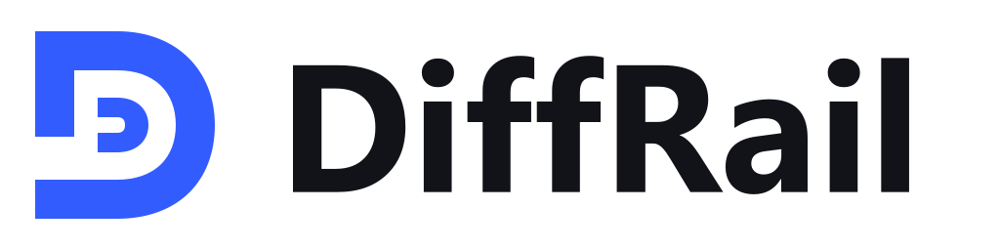

<div align="center">
  <h1>
    <picture>
      <source media="(prefers-color-scheme: dark)" srcset="docs/assets/diffrail-wordmark-dark.svg">
      <source media="(prefers-color-scheme: light)" srcset="docs/assets/diffrail-wordmark.svg">
      
    </picture>
  </h1>
  <p>Keep repository changes inside explicit file boundaries.</p>
  <p>
    <a href="https://github.com/beriktassuly/diffrail/actions/workflows/ci.yml"></a>
    <a href="https://github.com/beriktassuly/diffrail/releases/latest"></a>
    <a href="LICENSE"></a>
  </p>
  <p>
    <a href="#quick-start">Quick start</a> &middot;
    <a href="docs/policy-reference.md">Policy reference</a> &middot;
    <a href="docs/brand.md">Brand assets</a>
  </p>
</div>

DiffRail gives each coding task an explicit file boundary, treats shared contracts separately, and blocks out-of-scope changes before merge. In base-aware mode, the policy is read from the exact trusted base revision instead of the branch being checked, so that branch cannot widen its own permissions.

## What ships

- A deterministic CLI for local checks and CI gates.
- A GitHub Action for pull-request enforcement.
- A portable skill plugin for Cursor, ChatGPT/Codex, and Claude Code that teaches coding tools to inspect and verify the same policy.

The CLI is the enforcement layer. The plugin is the workflow and distribution layer. The installed CLI makes no network calls; initial installation and the current source-building GitHub Action do require network access.

## Quick start

Git is required. For an installation without Rust, download the archive for your platform from [GitHub Releases](https://github.com/beriktassuly/diffrail/releases/tag/v0.2.1), verify it against `SHA256SUMS`, extract it, and put the executable on your `PATH`:

| Platform | Archive |
| --- | --- |
| Windows x64 | `diffrail-v0.2.1-x86_64-pc-windows-msvc.zip` |
| Linux x64 | `diffrail-v0.2.1-x86_64-unknown-linux-gnu.tar.gz` |
| macOS Apple Silicon | `diffrail-v0.2.1-aarch64-apple-darwin.tar.gz` |
| macOS Intel | `diffrail-v0.2.1-x86_64-apple-darwin.tar.gz` |

On macOS and Linux, retain executable permissions (`chmod +x diffrail` if needed). On Windows, the executable is `diffrail.exe`.

The Linux archive requires a GNU/glibc environment with glibc 2.35 or newer, not Alpine/musl. Downloads are unsigned: Windows and macOS may ask you to approve the executable. Code signing and macOS notarization are not included in this release.

Alternatively, with Git and Rust 1.85 or newer, install from the tagged source:

```sh
cargo install --git https://github.com/beriktassuly/diffrail --tag v0.2.1 --locked
diffrail --version
```

The crates.io package is published separately. Use the release archives or tagged Git installation until that publication is confirmed.

Initialize a repository:

```sh
diffrail init
```

Edit the generated `.diffrail.yml`, validate it, and commit it to the base branch before assigning work:

```sh
diffrail validate
git add .diffrail.yml
git commit -m "chore: define change boundaries"
```

Before committing, check staged, unstaged, and untracked work against the policy already committed at `HEAD`:

```sh
diffrail check --task example
```

After the branch contains commits, compare it with its trusted base:

```sh
git fetch origin main
diffrail check --task example --base origin/main
```

Exit code `0` means every changed path is authorized. Exit code `1` means the change crossed its declared boundary.

## Policy

```yaml
version: 1

policy:
  protected:
    - ".diffrail.yml"
    - ".github/**"
  shared:
    - "schemas/**"
    - "src/contracts/**"

tasks:
  checkout-ui:
    description: "Update checkout without changing shared contracts"
    allow:
      - "web/checkout/**"
      - "tests/checkout/**"
    allow_shared: []
    allow_protected: []
```

Each `tasks` entry is a named authorization profile. Assignment happens outside the policy: a user selects it locally, while a protected workflow selects it in CI. Rules are closed by default:

- Ordinary files require a match in `allow`.
- Shared contract files require a match in `allow_shared`.
- Protected files require a match in `allow_protected`.
- The policy file is always protected.
- Protected rules take precedence over shared and ordinary rules.

See the [policy reference](docs/policy-reference.md) and [complete example](examples/policy.yml).

## Pull-request gate

The task ID, base SHA, and workflow are all part of the authorization decision. Keep the task fixed in a protected workflow or derive it only from another trusted source.

```yaml
name: Change boundary

on:
  pull_request:

permissions:
  contents: read

jobs:
  check:
    runs-on: ubuntu-latest
    steps:
      - uses: actions/checkout@3d3c42e5aac5ba805825da76410c181273ba90b1 # v7.0.1
        with:
          fetch-depth: 0
          persist-credentials: false
      - uses: beriktassuly/diffrail@v0.2.1
        with:
          task: checkout-ui
          base: ${{ github.event.pull_request.base.sha }}
```

Pin the action to a release or, for the strongest supply-chain guarantee, a full commit SHA. Configure the job as a required status check and protect the base branch and workflow from unreviewed changes using your repository's existing rules.

The action compiles the small CLI from the selected revision and emits inline annotations for violations. A future binary-backed action can remove this cold-start cost.

## Machine-readable output

Use JSON for automation:

```sh
diffrail check \
  --task checkout-ui \
  --base origin/main \
  --format json
```

The report includes a schema version, policy revision, diff base, changed paths, violations, and summary counts. Output order is deterministic.

## Plugin installation

Install the CLI first; plugin hosts do not install the executable. Then add the plugin through the channel for your tool:

| Host | Installation |
| --- | --- |
| Cursor | Extract the plugin ZIP from the release into `~/.cursor/plugins/local/diffrail`, then reload Cursor. Official marketplace installation is available only after review and publication. |
| Claude Code | Run `/plugin marketplace add beriktassuly/diffrail`, then `/plugin install diffrail@diffrail`. Choose the installation scope when prompted. |
| ChatGPT desktop / Codex | Run `codex plugin marketplace add beriktassuly/diffrail --ref v0.2.1`, then `codex plugin add diffrail@diffrail`. Start a new session and restart the desktop app after the first install. |

If Codex has its plugin feature disabled, enable it first with `codex features enable plugins`.

The root `plugin.json` and `skills/diffrail/SKILL.md` are the portable package. Host-specific metadata exposes the same skill without duplicating its instructions. The skill verifies that the CLI exists before claiming a successful check. Local plugin imports may be restricted by an organization's host settings.

The release includes `diffrail-plugin-v0.2.1.zip` for local installation and skills-only submissions. It does not bundle the CLI. A host must have access to the repository and be able to run local terminal commands; a listing in a web directory does not provide that access.

GitHub marketplace installation and official directory publication are separate. See the [publishing checklist](docs/publishing.md) for submission steps, data-handling facts, and publisher verification requirements. This repository does not claim that official directory listings are already approved.

An MCP server is intentionally not part of this version. Local Git already supplies every capability needed by the checker; adding a server would increase installation and trust surface without strengthening enforcement. A service interface becomes useful later for centrally assigned tasks, organization policies, or audit history.

## Security model

With no `--base`, the CLI reads policy from the current `HEAD`, then evaluates staged, unstaged, and untracked changes. This is pre-commit feedback: it prevents an uncommitted policy edit from authorizing itself, but it cannot establish trust after a branch has already committed a replacement policy.

With `--base`, the CLI reads policy from that exact trusted base revision and evaluates branch changes from its merge-base with `--head` (default `HEAD`). Pending changes are included when checking the current `HEAD`. Use this mode for branches and CI, and supply the base and task from a protected source.

Base-aware checking prevents a branch from changing the policy and using those new rules in the same check. It does not authenticate who selected `--task`, and it cannot protect a workflow that a pull request is allowed to replace.

Version 0.2 checks file boundaries. It does not detect semantic conflicts, coordinate locks, run project tests, or prove that two individually valid changes integrate correctly.

The base-aware check evaluates a branch diff, not a prospective merge tree. On CI systems that check a raw branch head rather than a generated pull-request merge result, require the branch to be current with its base before treating the result as authoritative.

## Development

```sh
cargo fmt --all --check
cargo clippy --locked --all-targets --all-features -- -D warnings
cargo test --locked --all-features
```

Release builds also validate manifest versions, listing icons, and isolated allowed/denied changes. The [release workflow](https://github.com/beriktassuly/diffrail/blob/main/.github/workflows/release.yml) builds all four platforms and creates a draft only after every build and package check succeeds. See [v0.2.1 release notes](docs/releases/v0.2.1.md).

Licensed under MIT.
