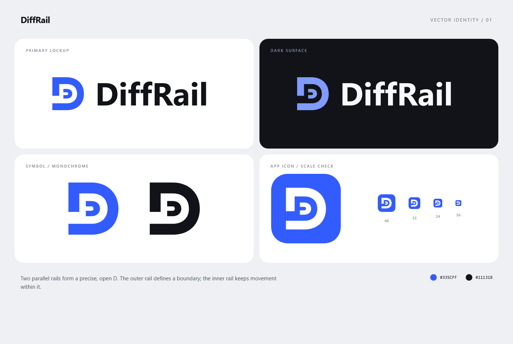

# DiffRail brand assets

Two parallel rails form an open letter D. The outer rail defines a boundary; the inner rail represents movement within it.

## Files

| Asset | Use |
| --- | --- |
| [Primary mark](assets/diffrail-logo.svg) | Standalone blue symbol on a light background |
| [Monochrome mark](assets/diffrail-mono.svg) | Single-color use on a light background |
| [App icon](assets/diffrail-icon.svg) | Square avatars and marketplace listings |
| [Light wordmark](assets/diffrail-wordmark.svg) | Logo with the product name on a light background |
| [Dark wordmark](assets/diffrail-wordmark-dark.svg) | Logo with the product name on a dark background |

All SVGs are self-contained vector paths. The wordmarks include outlined lettering, so they do not require an installed font. The marks and wordmarks have transparent backgrounds; the app icon includes its blue tile.

## Palette

| Color | Value |
| --- | --- |
| Primary blue | `#335CFF` |
| Ink | `#111318` |
| Blue on dark surfaces | `#819AFF` |
| Light lettering | `#F8F9FC` |

## Usage

- Preserve the proportions and the gap between the two rails.
- Leave at least one rail's width of clear space around the visible mark.
- Use the square app icon at 24 pixels or larger for normal interfaces. The 16-pixel preview is included as a small-size reference.
- Choose the wordmark variant that matches the background.
- Keep the logo flat; avoid stretching, shadows, added outlines, and gradients.

The assets are distributed under the repository's [MIT license](../LICENSE).
